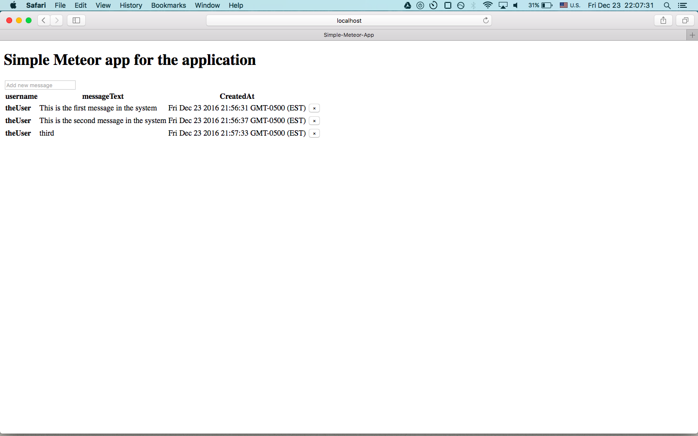

# Simple Meteor App

This is a simple application utilizing meteor.
It lists messages in the system in the order by which they were added.  You can add a new message or delete previous ones.

*Requirements:*
* meteor
* mongodb

*Building the project*

     $ meteor

 Then enter "http://localhost:3000/" into a web browser.
 
 
